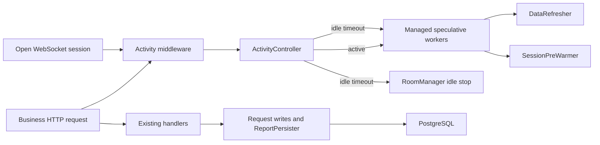

# Railway Serverless Runtime Design

## Context

Railway considers a service inactive only after it sends no outbound packets for more than ten minutes. The application currently cannot become quiet because it deliberately produces outbound traffic while no user is present:

- `DataRefresher` calls Warwick every 30 seconds.
- `SessionPreWarmer` calls Warwick and PostgreSQL every 20 seconds.
- `pgxpool` retains five minimum database connections.
- A started QR room polls Warwick until it is explicitly stopped, including after its browser has gone away.
- Startup synchronously hydrates and warms caches before the HTTP server begins serving.

The application must preserve authoritative check-in writes, report persistence, and active QR sessions while allowing speculative work to stop after user inactivity.

## Goals

- Produce no intentional outbound traffic within ten minutes of the last user activity.
- Preserve cache warming and low latency while users are active.
- Never cancel request-owned writes or durable report persistence as speculative work.
- Prevent abandoned QR rooms from keeping the service awake forever.
- Keep non-Railway and explicitly disabled deployments behaviorally compatible.
- Reduce cold-start work without weakening data correctness.

## Non-goals

- Guarantee that Railway's first wake-up request cannot receive a 502. That response occurs before application code can intervene.
- Add Redis, a scheduler, another Railway service, or push-based telemetry.
- Change Warwick's role as source of truth or PostgreSQL's role as durable L2 storage.
- Replace the existing request, cache, room, or persistence domain models.

## Alternatives Considered

### Permanently disable background work

A serverless environment flag could disable refreshers and pre-warming for the process lifetime. This is operationally simple but makes every active user absorb avoidable cold-cache latency.

### Split web and worker services

The web process could sleep while a dedicated worker performs refreshes. This isolates workloads well but keeps the worker bill running and adds another deployment and failure domain.

### Activity-gated runtime (selected)

Speculative workers run during active use and stop after a short quiet period. The design retains active-user performance while creating a deterministic outbound-free window for Railway.

## Architecture



### Components and responsibilities

#### `ActivityController`

Owns exactly one concern: transition the speculative runtime between active and idle states. Its public interface is intentionally small:

```go
type ActivityRecorder interface {
    RecordActivity()
}

type ActivityController interface {
    ActivityRecorder
    Run(context.Context)
}
```

`Run` owns timer state. `RecordActivity` is non-blocking and concurrency-safe. Repeated activity while already active resets the idle deadline without starting duplicate workers. Activity racing with idle expiration produces one serialized transition; if expiration wins, the subsequent activity starts a new worker generation.

#### `ManagedWorker`

Hides the lifecycle details of one or more speculative loops:

```go
type ManagedWorker interface {
    Run(context.Context)
}
```

The controller creates one child context for the current active generation and runs each configured worker with it. Cancelling that context stops the data refresher and session pre-warmer. Starting a later generation receives a fresh context. Workers remain independently testable through their existing `Run` behavior.

#### Activity middleware

Records activity before forwarding business requests. It excludes `/api`, `/api/`, `/metrics`, and static assets so health checks and metric scrapes do not activate outbound work. Teacher and room API calls count as activity.

A WebSocket records activity when accepted, but an open socket is not a permanent activity lease. Otherwise an abandoned browser tab could keep speculative workers active forever. Actual room and teacher API requests extend the deadline. WebSocket events may still be sent while active room work exists; the idle transition stops that work before Railway's quiet window begins.

#### QR room lifecycle

QR workers are demand work while a user is present but become speculative after all activity disappears. On the idle transition, the controller invokes a narrow boundary:

```go
type IdleHandler interface {
    HandleIdle(context.Context) error
}
```

The production implementation asks `RoomManager` to stop all active rooms, waits for their workers to cancel, and persists the stopped state with a bounded context. It must not use detached write goroutines for this transition. The existing UI restarts a stopped room when its session page is visited again.

#### Database pool

Serverless mode configures `MinConns = 0` and `MaxConnIdleTime = 2m`. Once activity stops, unused connections are removed by pgxpool's health cycle, leaving no minimum connection floor. Normal mode retains the current tuning.

#### Startup

Startup performs only required configuration, migrations, dependency wiring, and room metadata loading. Warwick cache warm-up and report hydration are removed from the synchronous boot path. Demand reads use the existing cache → PostgreSQL → Warwick fallback. Activity-gated workers warm subsequent requests asynchronously.

The Warwick session pool is safe to construct at boot because it does not log in until a tier is acquired.

## SOLID Assessment

- **SRP:** lifecycle policy lives in `ActivityController`; request classification lives in middleware; worker behavior stays in existing services; room shutdown stays in `RoomManager`; configuration parsing stays in `app.Config`.
- **OCP:** new speculative workers and idle handlers are added through small interfaces without changing controller logic. The existing refresher implementations require no Railway-specific branches.
- **LSP:** production workers and deterministic test workers obey the same blocking-until-context-cancelled contract.
- **ISP:** request and WebSocket boundaries depend only on `RecordActivity`; the controller depends only on `ManagedWorker` and `IdleHandler`.
- **DIP:** lifecycle policy depends on injected clock/timer, worker, and idle-handler abstractions rather than HTTP, pgxpool, or Warwick implementations.

## Configuration

| Variable | Default | Meaning |
|---|---:|---|
| `SERVERLESS_ENABLED` | `true` when `RAILWAY_ENVIRONMENT` is present; otherwise `false` | Enables activity-gated workers and zero-minimum DB pooling. |
| `SERVERLESS_IDLE_GRACE` | `2m` | Quiet period before speculative workers and rooms stop. Must be below Railway's ten-minute inactivity window. |

Invalid booleans or durations fail configuration loading rather than silently enabling a surprising runtime mode. An idle grace outside `30s..8m` is rejected. The upper bound reserves at least two minutes for in-flight traffic and connection draining.

## State Model

The controller has two observable states:

```text
Idle --activity-------> Active
Active --activity------> Active (deadline reset)
Active --deadline elapsed--> Idle
Idle --shutdown--------> Stopped
Active --shutdown------> Stopped
```

Properties:

- At most one speculative worker generation is active.
- Worker cancellation happens before idle handlers run.
- An activity event received during idle handling schedules a new active generation immediately after the serialized idle transition completes.
- Process shutdown cancels active workers and does not start another generation.

## Error Handling

- Worker errors remain locally logged by each worker; they do not terminate the controller.
- Idle room persistence uses a bounded context and reports aggregate failures without blocking shutdown indefinitely.
- A failed idle handler does not restart speculative workers. This avoids an error loop that would itself produce outbound traffic.
- Activity notification is buffered/coalesced so request handlers never wait on controller scheduling.
- Panics in managed worker goroutines are recovered at the lifecycle boundary and logged.

## Observability

Use structured local logs only:

- `serverless_runtime_active` with worker generation.
- `serverless_runtime_idle` with last activity time.
- `serverless_worker_stopped` with shutdown duration.
- `serverless_idle_handler_failed` with handler and error.

Prometheus remains pull-only. No new telemetry exporter or heartbeat is introduced.

## TDD Behavior Order

Implementation proceeds as vertical red-green slices through public interfaces:

1. First business activity starts exactly one worker generation.
2. Repeated activity extends the deadline without duplicating workers.
3. Expired inactivity cancels workers.
4. Activity after idling starts a fresh generation.
5. Idle transition invokes QR-room cleanup after worker cancellation.
6. Health, metrics, and static requests do not record activity; business routes and WebSocket establishment do.
7. An open but idle WebSocket does not prevent the idle transition.
8. Serverless configuration selects zero-minimum DB pooling and validates grace bounds.
9. Disabled mode preserves continuously running refreshers and existing pool behavior.
10. Application shutdown cancels the controller and all active workers.

Tests use a fake clock/timer only at the time boundary and fakes for external Warwick/DB boundaries. They assert observable lifecycle behavior rather than private fields or call ordering, except where cancellation-before-idle-cleanup is itself a required safety contract.

## Acceptance Criteria

- With serverless mode enabled, no data refresher or pre-warmer runs before business activity.
- Business activity activates both speculative workers once.
- After two minutes without business activity, speculative workers and QR workers stop even if a WebSocket remains open.
- PostgreSQL retains zero minimum connections and drains idle connections within the grace budget.
- Durable writes and queued report persistence are not cancelled by the idle transition.
- Health checks, metrics scrapes, and static file requests do not activate workers.
- A later request reactivates workers and reads continue through the existing fallback chain.
- Normal mode retains existing always-on background behavior.
- Go tests, race-sensitive lifecycle tests, lint/static analysis, frontend tests, and production builds pass.

## Rollout and Rollback

Deploy with `SERVERLESS_ENABLED=true` on one Railway environment. Confirm lifecycle logs show an idle transition and Railway metrics show no outbound traffic afterward. Then enable Railway Serverless for the service.

Rollback is configuration-only: set `SERVERLESS_ENABLED=false` and redeploy. No schema or data migration is involved.
